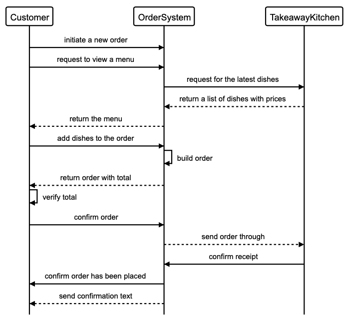

# UBEROO

User Stories
-----
```
As a customer
So that I can check if I want to order something
I would like to see a list of dishes with prices
```
```
As a customer
So that I can order the meal I want
I would like to be able to select some number of several available dishes
```
```
As a customer
So that I can verify that my order is correct
I would like to check that the total I have been given matches the sum of the various dishes in my order
```
```
As a customer
So that I am reassured that my order will be delivered on time
I would like to receive a text such as "Thank you! Your order was placed and will be delivered before 18:52" after I have ordered
```

Takeaway Sequence Diagram
-----


Instructions
------------------
Viewing the menu:

```
2.7.0 :001 > require './lib/ordersystem'
 => true
2.7.0 :002 > order = OrderSystem.new
2.7.0 :003 > order.view_menu
=> [{:dish=>"Edamame", :price=>3}, {:dish=>"Salmon Sashimi", :price=>5}, {:dish=>"Toro Sashimi", :price=>7}, {:dish=>"Salmon Nigiri", :price=>6}, {:dish=>"Toro Nigiri", :price=>8}, {:dish=>"California Maki", :price=>7}, {:dish=>"Matcha Mochi", :price=>2}, {:dish=>"Mango Mochi", :price=>2}]
 ```

 Adding to the order (default quantity is 1 ):
 ```
 2.7.0 :004 > order.add_to_order("Edamame", 2)
  => [{:dish=>"Edamame", :quantity=>2, :price=>6}]
 2.7.0 :005 > order.add_to_order("Salmon Sashimi", 3)
  => [{:dish=>"Edamame", :quantity=>2, :price=>6}, {:dish=>"Salmon Sashimi", :quantity=>3, :price=>15}]
 2.7.0 :006 > order.add_to_order("California Maki")
  => [{:dish=>"Edamame", :quantity=>2, :price=>6}, {:dish=>"Salmon Sashimi", :quantity=>3, :price=>15}, {:dish=>"California Maki", :quantity=>1, :price=>7}]
 2.7.0 :007 > order.add_to_order("Matcha Mochi")
  => [{:dish=>"Edamame", :quantity=>2, :price=>6}, {:dish=>"Salmon Sashimi", :quantity=>3, :price=>15}, {:dish=>"California Maki", :quantity=>1, :price=>7}, {:dish=>"Matcha Mochi", :quantity=>1, :price=>2}]
 ```

Removing from the order:
```
2.7.0 :008 > order.remove_from_order("Matcha Mochi")
 => [{:dish=>"Edamame", :quantity=>2, :price=>6}, {:dish=>"Salmon Sashimi", :quantity=>3, :price=>15}, {:dish=>"California Maki", :quantity=>1, :price=>7}]
```

Raises an error if not on the order:
```
2.7.0 :009 > order.remove_from_order("Matcha Mochi")
Traceback (most recent call last):
        ...
RuntimeError (This isn't on the order)
```

Viewing the order:
```
2.7.0 :010 > order.view_order
Edamame x 2 = £6
Salmon Sashimi x 3 = £15
California Maki x 1 = £7
```

Viewing the total:
```
2.7.0 :011 > order.view_total
Order total is: £28
```

Proceeding to purchase the order:
```
2.7.0 :012 > order.checkout
Happy to proceed with order (y/n) ?
y
```


**Errors:**

Removing an item from an empty order:
```
2.7.0 :003 > order.remove_from_order("Edamame")
Traceback (most recent call last):
        ...
RuntimeError (The order is currently empty)
```

Adding a dish to the order that doesn't exist:
```
2.7.0 :004 > order.add_to_order("Chicken Strips")
Traceback (most recent call last):
        ...
RuntimeError (This isn't on the menu)
```

Tech Stack
------------------
Ruby 2.7.0  
RSpec
